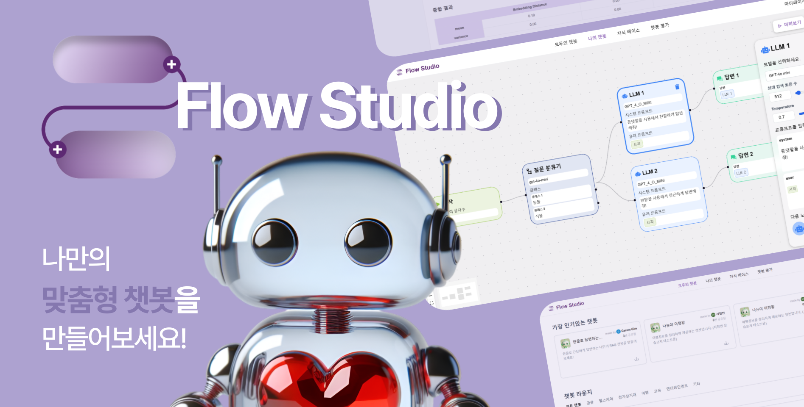
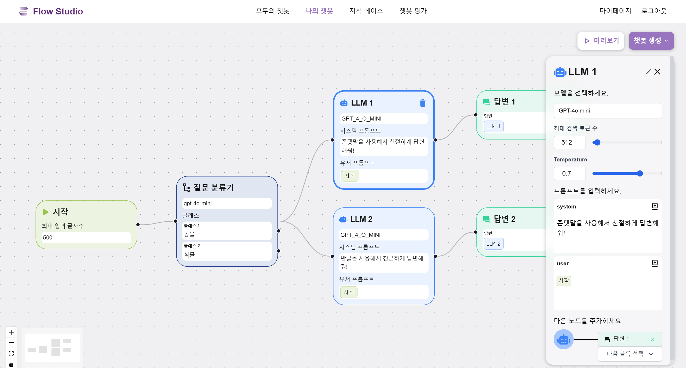
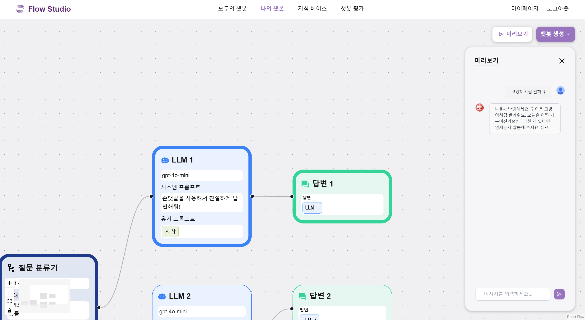
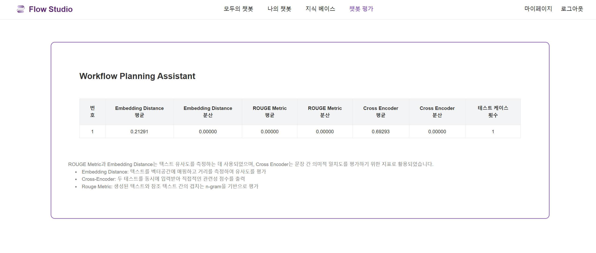
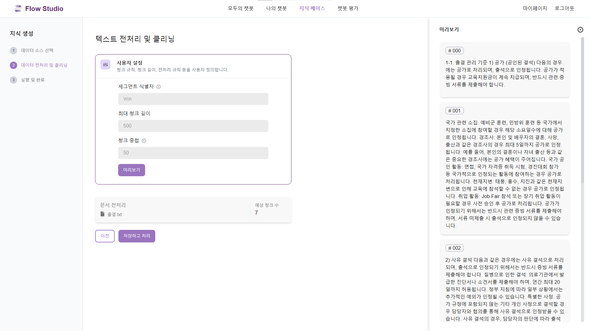
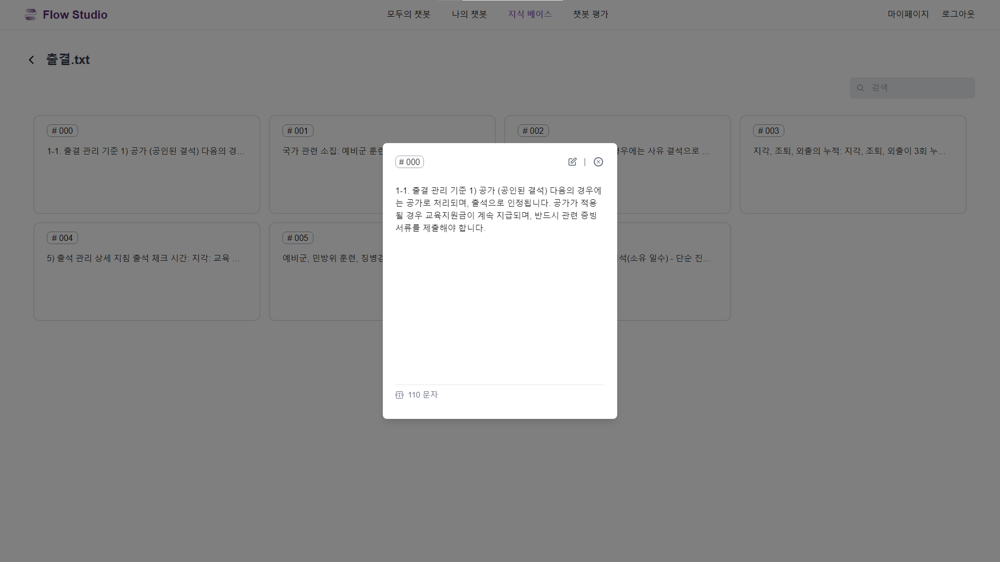

# 🤖 Flow Studio

## 💜 프로젝트 소개

챗봇을 만들어보고 싶은데 너무 어려우셨나요? 
어디서부터 시작해야 할지 막막하고, 기업용 솔루션은 부담스러우셨죠?

Flow Studio는 **누구나 쉽게 LLM 챗봇을 만들 수 있도록 돕는 플랫폼**입니다. 
복잡한 코딩 대신 직관적인 플로우 차트를 이용해, 블록코딩을 하듯 챗봇의 흐름을 디자인해보세요! 
뿐만 아니라, RAG 기술로 여러분의 지식을 챗봇에 더해 개인화된 경험을 제공합니다. 

Flow Studio와 함께라면 챗봇 제작이 더 이상 어렵지 않습니다. 
여러분만의 다양한 챗봇 아이디어를 실현해보세요! 😊🚀

## 💜 프로젝트 기간
2024.10.14 ~ 2024.11.26 (7주)

## 💜 주요 기능

### 챗봇 만들기

- LLM, 질문 분류기, 답변 등의 노드를 추가하고 연결하여 챗봇의 대화 흐름을 구성할 수 있습니다.
- 챗플로우를 설정한 후 미리보기로 즉시 테스트해 챗봇의 답변을 실시간으로 확인하고 수정할 수 있습니다.

### 챗봇 공유

- 나의 챗봇을 다른 사용자에게 공유할 수 있습니다.
- 다른 사용자가 만든 챗봇을 나의 챗봇으로 가져와 필요에 맞게 커스터마이징할 수 있습니다.

### 챗봇 평가

- 성능 검증을 위해 원하는 질문과 예상 답변을 입력해 챗봇의 정확성을 테스트할 수 있습니다.
- 생성된 답변과 입력한 정답을 비교해 챗봇의 성능을 평가할 수 있습니다.
- Embedding Distance, Cross-Encoder, ROUGE Metric 등 다양한 지표로 평가 결과를 확인하고 분석할 수 있습니다.

### 지식 베이스

- 챗플로우 제작시 지식 검색 노드에 활용할 지식을 등록하고 관리할 수 있습니다.
- 지식의 상세 내용들을 추가, 수정, 삭제할 수 있습니다.

## 💜 기술 스택

### **Backend**

                  

### **Frontend**

              

### **CI/CD**

     

### **Communication**

    

## 💜 팀원 소개
|  |   |  |  |  |  |
|---------------------------------------------------------------------------------------------------------------|----------------------------------------------------------------------------------------------------|---------------------------------------------------------------------------------------------------------------|-------------------------------------------------------------------------------------------------|--------------------------------------------------------------------------------------------------|--------------------------------------------------------------------------------------------------|
| 김가람([@garamgim](https://github.com/garamgim)) | 장재훈([@JaeHunJang](https://github.com/JaeHunJang))  | 최재원([@Jaewooooon](https://github.com/Jaewooooon)) | 김민선([@minseonkkim](https://github.com/minseonkkim)) | 고도연([@doyeon01](https://github.com/doyeon01)) | 정현수([@surina125](https://github.com/surina125)) |
| Leader / Back End / Infra | Back End | Back End | Front End | Front End | Front End |

## 💜 프로젝트 산출물

- [요구사항명세서](./docs/요구사항명세서.md)
- [와이어프레임](./docs/와이어프레임.md)
- [API명세서](./docs/API명세서.md)
- [ERD](./docs/ERD.md)
- [목업](./docs/목업.md)
- [아키텍처](./docs/아키텍처.md)

## 💜 프로젝트 결과물

- [포팅메뉴얼](./exec/포팅매뉴얼.md)
- [중간발표자료](./docs/assets/FlowStudio_중간발표.pdf)
- [최종발표자료](./docs/assets/FlowStudio_최종발표.pdf)

## 💜 시연 영상

https://github.com/user-attachments/assets/ccbc0f2d-6fc5-487a-9c10-8c7ac08b0f09

