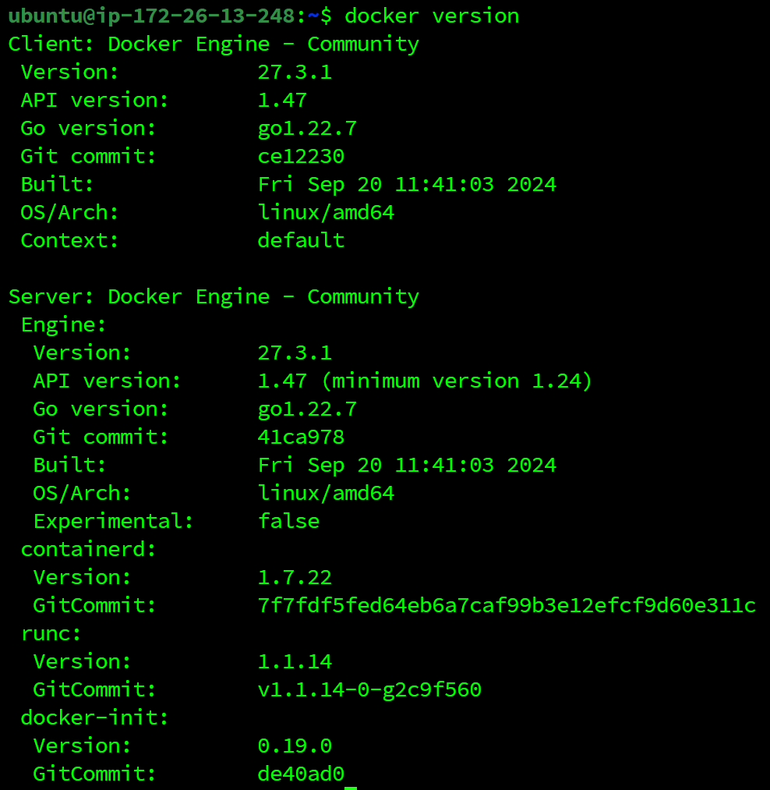
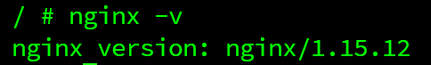

## Gitlab 소스 클론 이후 빌드 및 배포할 수 있도록 정리한 문서
1. 사용한 JVM, 웹서버, WAS 제품 등의 종류와 설정 값, 버전 기재

    - Docker version
                
        
                
    -  Nginx 버전 (Docker container)
                
        
                
    - Nginx docker compose

        ```yaml
        version: '3'
        services:
        nginx:
            image: nginx:1.15-alpine
            ports:
            - "80:80"
            - "443:443"
            volumes:
            - ./data/nginx:/etc/nginx/conf.d
            - ./data/certbot/conf:/etc/letsencrypt
            - ./data/certbot/www:/var/www/certbot
            command: "/bin/sh -c 'while :; do sleep 6h & wait $${!}; nginx -s reload; done & nginx -g \"daemon off;\"'"
        certbot:
            image: certbot/certbot
            restart: unless-stopped
            volumes:
            - ./data/certbot/conf:/etc/letsencrypt
            - ./data/certbot/www:/var/www/certbot
            entrypoint: "/bin/sh -c 'trap exit TERM; while :; do certbot renew; sleep 12h & wait $${!}; done;'"
        ```

    - Nginx 설정
        
        ```yaml
        upstream jenkins {
            server 127.0.0.1:7000;
            keepalive 32;
        }
        
        server {
            listen 80;
            server_name k11c201.p.ssafy.io;
            server_tokens off;
        
            location /.well-known/acme-challenge/ {
                root /var/www/certbot;
            }
        
            location / {
                return 301 https://$host$request_uri;
            }
        }
        
        map $http_upgrade $connection_upgrade {
            default upgrade;
            '' close;
        }
        
        server {
            listen 443 ssl;
            server_name k11c201.p.ssafy.io;
            server_tokens off;
        
            client_max_body_size 100M;
        
            ssl_certificate /etc/letsencrypt/live/k11c201.p.ssafy.io/fullchain.pem;
            ssl_certificate_key /etc/letsencrypt/live/k11c201.p.ssafy.io/privkey.pem;
            include /etc/letsencrypt/options-ssl-nginx.conf;
            ssl_dhparam /etc/letsencrypt/ssl-dhparams.pem;
        
            location / {
                proxy_pass http://k11c201.p.ssafy.io:3000;
                proxy_set_header    Host                $http_host;
                proxy_set_header    X-Real-IP           $remote_addr;
                proxy_set_header    X-Forwarded-For     $proxy_add_x_forwarded_for;
                proxy_set_header X-Forwarded-Proto $scheme;
            }
            
            location /api {
                proxy_pass http://k11c201.p.ssafy.io:9090;
                proxy_set_header    Host                $http_host;
                proxy_set_header    X-Real-IP           $remote_addr;
                proxy_set_header    X-Forwarded-For     $proxy_add_x_forwarded_for;
                proxy_set_header X-Forwarded-Proto $scheme;
                proxy_set_header Authorization $http_authorization;
            }
        
            location /api/v1/sse {
                proxy_pass http://k11c201.p.ssafy.io:9090;
                proxy_set_header    Host                $http_host;
                proxy_set_header    X-Real-IP           $remote_addr;
                proxy_set_header    X-Forwarded-For     $proxy_add_x_forwarded_for;
                proxy_set_header X-Forwarded-Proto $scheme;
                proxy_set_header Authorization $http_authorization;
                proxy_set_header Connection '';
                proxy_http_version 1.1;
                proxy_read_timeout 21600s;
            }
        
            location /login/oauth2 {
                proxy_pass http://k11c201.p.ssafy.io:9090;
                proxy_set_header    Host                $http_host;
                proxy_set_header    X-Real-IP           $remote_addr;
                proxy_set_header    X-Forwarded-For     $proxy_add_x_forwarded_for;
                proxy_set_header    X-Forwarded-Proto   $scheme;
            }
            
            location /oauth2 {
                proxy_pass http://k11c201.p.ssafy.io:9090;
                proxy_set_header    Host                $http_host;
                proxy_set_header    X-Real-IP           $remote_addr;
                proxy_set_header    X-Forwarded-For     $proxy_add_x_forwarded_for;
                proxy_set_header    X-Forwarded-Proto   $scheme;
            }
        
            location /langchain {
                proxy_pass http://k11c201.p.ssafy.io:9700;
                proxy_set_header    Host                $http_host;
                proxy_set_header    X-Real-IP           $remote_addr;
                proxy_set_header    X-Forwarded-For     $proxy_add_x_forwarded_for;
                proxy_set_header    X-Forwarded-Proto   $scheme;
            }
        
            location /langchain/docs {
                proxy_pass http://k11c201.p.ssafy.io:9700/docs;
                proxy_set_header    Host                $http_host;
                proxy_set_header    X-Real-IP           $remote_addr;
                proxy_set_header    X-Forwarded-For     $proxy_add_x_forwarded_for;
                proxy_set_header    X-Forwarded-Proto   $scheme;
            }
        
            location /openapi.json {
                proxy_pass http://k11c201.p.ssafy.io:9700/openapi.json;
                proxy_set_header    Host                $http_host;
                proxy_set_header    X-Real-IP           $remote_addr;
                proxy_set_header    X-Forwarded-For     $proxy_add_x_forwarded_for;
                proxy_set_header    X-Forwarded-Proto   $scheme;
            }
            
            location /docs {
                autoindex on;
        
                proxy_pass http://k11c201.p.ssafy.io:13000;
                proxy_set_header    Host                $http_host;
                proxy_set_header    X-Real-IP           $remote_addr;
                proxy_set_header    X-Forwarded-For     $proxy_add_x_forwarded_for;
                proxy_set_header X-Forwarded-Proto $scheme;
            }
        
            location /jenkins {
                proxy_pass         http://k11c201.p.ssafy.io:7000;
                proxy_set_header   Connection        $connection_upgrade;
                proxy_set_header   Upgrade           $http_upgrade;
                proxy_set_header   Host              $http_host;
                proxy_set_header   X-Real-IP         $remote_addr;
                proxy_set_header   X-Forwarded-For   $proxy_add_x_forwarded_for;
                proxy_set_header   X-Forwarded-Proto $scheme;
        
                proxy_connect_timeout      90;
                proxy_send_timeout         90;
                proxy_read_timeout         90;
                proxy_request_buffering    off; # Required for HTTP CLI commands
                proxy_set_header Connection ""; # Clear for keepalive
            }
        }
        ```
            
    - 백엔드 버전
        
        ```yaml
        # JAVA
        Oracle OpenJDK 17.0.10
        
        # Python
        Python 3.12
        
        # IDE
        IntelliJ IDEA 2024.1.4 (Ultimate Edition)
        PyCharm 2024.2 (Professional Edition)
        ```
        
    - 프론트엔드 버전
        
        ```yaml
        "next": "14.2.15",
        "react": "^18",
        "reactflow": "^11.11.4",
        "recoil": "^0.7.7"
        ```
            
2. 빌드 시 사용되는 환경변수등의 내용 상세 기재
    - .env (Spring)
        
        ```yaml
        # Database
        MYSQL_PORT=
        MYSQL_ROOT_PASSWORD=
        MYSQL_PRIMARY_DATABASE=flowstudio-db
        MYSQL_SECONDARY_DATABASE=publish-db
        
        # Swagger-ui
        SWAGGER_PORT=
        
        # Redis
        REDIS_PORT=
        REDIS_PASSWORD=
        REDIS_INSITE_PORT=
        REDIS_TEST_PORT=
        
        # JWT
        JWT_SECRET=
        JWT_ACCESS_EXPIRATION=
        JWT_REFRESH_EXPIRATION=
        
        # DDL
        DEV_DDL_AUTO=none
        PROD_DDL_AUTO=none
        
        # Oauth2
        # google
        GOOGLE_CLIENT_ID=
        GOOGLE_CLIENT_SECRET=
        # kakao
        KAKAO_CLIENT_ID=
        KAKAO_CLIENT_SECRET=
        # github
        GITHUB_CLIENT_ID=
        GITHUB_CLIENT_SECRET=
        
        # Backend server domain
        BACKEND_SERVER_DOMAIN=
        
        # API Keys
        OPENAI_API_KEY=
        CLAUDE_API_KEY=
        GEMINI_API_KEY=
        CLOVA_API_KEY=
        
        #Milvus
        MILVUS_HOST=
        MILVUS_PORT=
        MILVUS_TOKEN=root:Milvus
        MILVUS_DB_NAME=default
        
        # FastAPI URL
        LANGCHAIN_FASTAPI_URL=
        LANGCHAIN_FASTAPI_PORT=
        
        # S3
        S3_BUCKET_NAME=
        S3_ACCESS_KEY=
        S3_SECRET_KEY=
        
        # AES 대칭키
        SYMMETRIC_KEY=
        ```
            
    - .env (FastAPI)
        
        ```yaml
        OPENAI_API_KEY=
        ```
        
    - .env (React)
        
        ```yaml
        NEXT_PUBLIC_FRONT_URL=
        NEXT_PUBLIC_BASE_URL=
        ```
            
3. 실행 방법
    - Backend (Spring)
        
        ```bash
        cd S11P31C201/backend/flowstudio
        docker compose -f docker-compose-prod.yml up -d
        docker compose -f milvus-standalone-docker-compose.yml up -d
        ```
        
    - Backend (FastAPI)
        
        ```bash
        cd S11P31C201/python/flowstudio
        docker build -t flowstudio-python .
        docker run --name flowstudio-python -p 9700:9700 -d flowstudio-python
        ```
        
    - Frontend
        
        ```bash
        cd S11P31C201/frontend/flowstudio
        docker build -t nextjs .
        docker run -d --name flowstudio-client -p 3000:3000 nextjs
        ```
            
4. DB 접속 정보 등 프로젝트에 활용되는 주요 계정(ERD) 및 프로퍼티가 정의된 파일 목록

    - 해당없음

<br>

## 프로젝트에서 사용하는 외부 서비스 정보를 정리한 문서
소셜 로그인 시 Kakao, Google, Github Id, Secret 필요

<br>

## DB 덤프 파일 최신본
덤프파일 없이 바로 실행 가능

<br>
    
## 시연 시나리오

1. 나의 챗봇 → 챗봇 생성 → 시작, LLM 노드, 답변로만 구성 후 부정확한 답변이 오는것을 확인
2. 모두의 챗봇 → 공유 되어있는 챗봇을 공유해오기
3. 지식베이스 → 파일 업로드 → 최대 청크 길이 설정 → 청크 중첩 길이 설정 → 미리보기 → 저장하고 처리하기
4. 챗봇 생성 → 질문 분류기 노드 생성 후 질문 클래스 수정  → 질문 검색 노드 생성 후 문서 연결 → 간선 연결 → 미리보기 → 메시지 입력 → 정확한 답변 오는것 확인
5. 챗봇 평가 → 챗봇 평가하기 → 만든 챗봇 선택 → 테스트 질문 입력
6. 나의 챗봇 → 챗봇 생성 → 업데이트 → 앱 실행 → 앱 사용